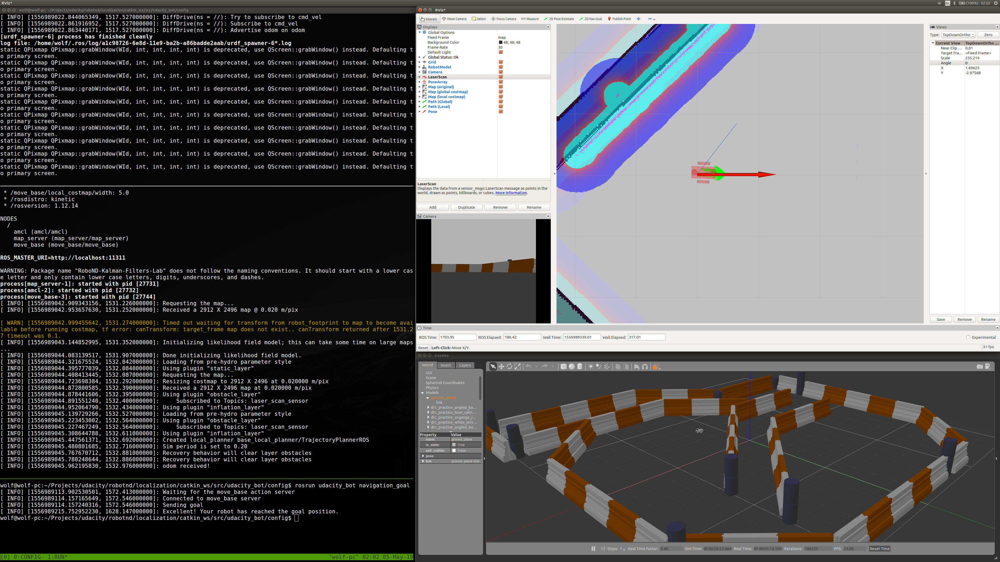
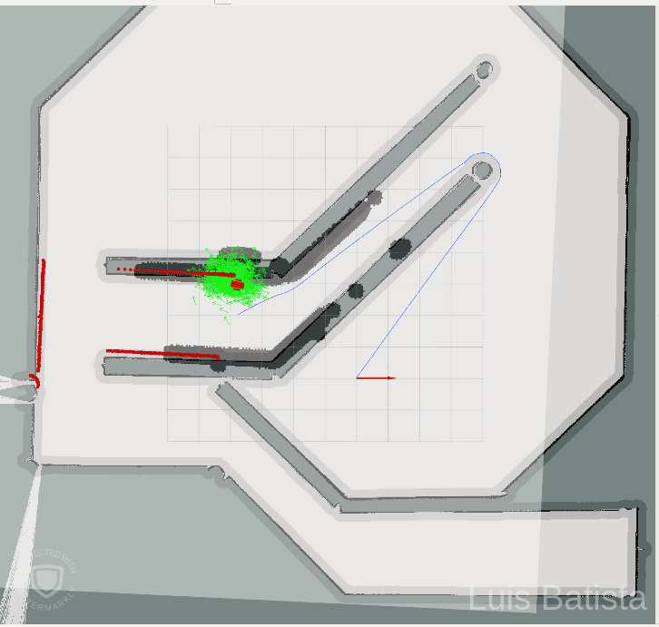
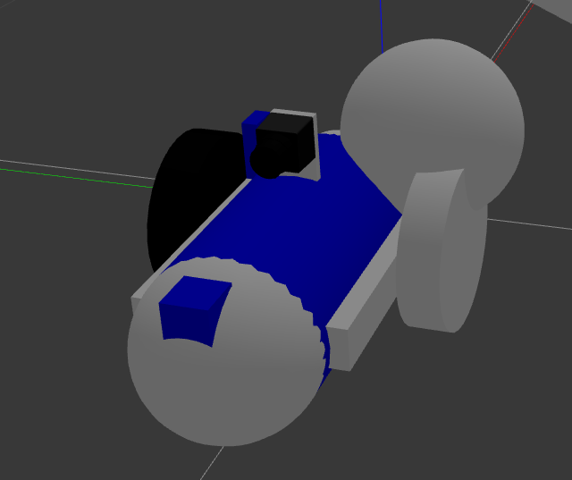

# Project: Where Am I 


### Information 

The goal of this project is to learn how to use ROS to create a robot and accurately localize it inside a map in the Gazebo nad RViz simulation evironment. 
This project is part of the second term of the Robotics Software Engineer Nanodegree from Udacity.

Report can be found .

The tasks include:
* Build a mobile robot for simulated tasks.
* Create a ROS package that launches the custom robot model in Gazebo and utilizes the AMCL and Navigation Stack packages. 
* Explore, add, and tune parameters of each package to achieve better localization results.




### Build and run

Dependencies 
```bash
sudo apt-get install ros-kinetic-navigation
sudo apt-get install ros-kinetic-map-server
sudo apt-get install ros-kinetic-move-base
rospack profile
sudo apt-get install ros-kinetic-amcl
```

Execute Simulation
```bash
cd /home/workspace/catkin_ws/
catkin_make
source devel/setup.bash
roslaunch udacity_bot udacity_world.launch
roslaunch udacity_bot 
```

Change Robot model
```bash
# Edit include in launch file
vim launch/udacity_world.launch
```

### Results
AMCL particle cloud converges quickly after the robot start mooving. 
Planned path is followed and obtacles are avoided. The simulated robots can reach the target position. 


### Future activities
* Add teleop package to control the custom robot model from keyboard
* Adjust Sensor noise parameters in AMCL Package
* Make simulation using the Turtlebot robot
* Add obstacles and more complex navigation targets


### Bloopers

AMCL not converging. Robot starting off the wrong direction and getting stuck too close to the wall.



Misplacing the decimal point in the caster (sphere radius) when designing the roobot.

